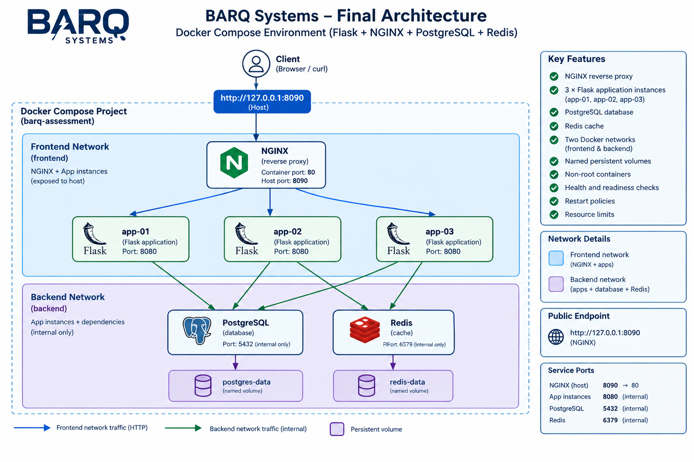

# BARQ Systems — DevOps Assessment

A repaired and validated Docker Compose environment for a Flask API behind NGINX, with PostgreSQL and Redis dependencies.

The project was investigated and fixed incrementally while preserving the supplied repository history and documenting troubleshooting, testing, security, and technical decisions.

## Final Architecture



The final runtime contains:

- NGINX reverse proxy
- Flask application instances:
  - `app-01`
  - `app-02`
  - `app-03`
- PostgreSQL database
- Redis
- Frontend Docker network for NGINX and application instances
- Internal backend Docker network for applications and dependencies
- Named persistent volumes for PostgreSQL and Redis
- Application containers running as a non-root user
- Health and readiness checks
- Restart policies and resource limits

### Final public endpoint

```text
http://127.0.0.1:8090
```

NGINX listens on container port 80 and is published on host port 8090.

Application instances listen on port 8080 internally.

## Repository Structure

```
.
├── app/                    # Flask application
├── database/               # PostgreSQL initialization
├── nginx/                  # NGINX configuration
├── logs/                   # Historical synthetic logs
├── tests/                  # Application-only tests
├── scripts/                # Supporting scripts
├── assessment/             # Task and API contract
├── docs/                   # Evidence and architecture documentation
├── .github/workflows/      # GitHub Actions CI
├── Dockerfile
├── docker-compose.yml
├── validate.py
├── failure_test.py
├── backup.sh
├── restore.sh
├── video_challenge.sh
├── troubleshooting.md
├── log_analysis.md
├── decisions.md
├── security_review.md
└── AI_USAGE.md
```

## Prerequisites

- Linux or WSL2
- Git
- Docker
- Docker Compose
- Python 3.12 for local test scripts

Recommended capacity:

- 2 CPU cores
- 4 GB free RAM
- 3 GB free disk plus Docker overhead

## Configuration

The repository does not contain real secrets.

Create a local `.env` file from the example:

```bash
cp .env.example .env
```

Set a local PostgreSQL password in `.env`.

The `.env` file is ignored by Git and must not be committed.

For the final runtime:

```
PUBLIC_PORT=8090
```

## Build and Start

From the repository root:

```bash
docker compose up --build -d
```

Check the running services:

```bash
docker compose ps
```

All application and dependency services should report healthy.

Check logs when troubleshooting:

```bash
docker compose logs --no-color
```

## Final Services

The final Compose environment contains:

| Service | Role | Network |
|---|---|---|
| nginx | Reverse proxy / public entry point | frontend |
| app-01 | Flask application | frontend + backend |
| app-02 | Flask application | frontend + backend |
| app-03 | Flask application | frontend + backend |
| postgres | PostgreSQL database | backend |
| redis | Redis dependency | backend |

Only NGINX is publicly published.

PostgreSQL and Redis do not expose host ports.

## Application Endpoints

The public API is accessed through NGINX:

```bash
curl http://127.0.0.1:8090/
curl http://127.0.0.1:8090/health
curl http://127.0.0.1:8090/ready
curl http://127.0.0.1:8090/records
curl http://127.0.0.1:8090/counter
curl http://127.0.0.1:8090/instance
```

### Endpoint purpose

- `/` — basic application response
- `/health` — application liveness check
- `/ready` — dependency/readiness check
- `/records` — PostgreSQL-backed records
- `/counter` — Redis-backed request counter
- `/instance` — identifies the application instance serving the request

## Verify Load Balancing

The `/instance` endpoint can be requested repeatedly to observe traffic reaching the three application instances:

```bash
for i in {1..12}; do
  curl -s http://127.0.0.1:8090/instance
done
```

The responses should include all three application instances:

- app-01
- app-02
- app-03

NGINX uses Docker Compose service names rather than hard-coded container IP addresses.

## Health and Readiness

Application health checks use:

```
/health
```

Readiness verifies the application's required dependencies.

A healthy application process does not necessarily mean the application is ready to serve dependency-dependent requests. This distinction was used during troubleshooting.

## Validation

Run the complete environment validation:

```bash
PUBLIC_PORT=8090 APP_INSTANCES=app-01,app-02,app-03 python3 validate.py
```

The validation checks:

- required services
- service health
- application endpoints
- load balancing
- application network configuration
- backend dependency connectivity

## Failure Recovery Test

The failure test verifies that traffic continues through the remaining application instances while one backend is stopped and that the stopped instance can recover.

Run:

```bash
PUBLIC_PORT=8090 TARGET=app-02 python3 failure_test.py
```

The test reports baseline traffic, traffic during backend failure, and traffic after recovery.

## PostgreSQL Persistence

PostgreSQL data is stored in the named Docker volume:

```
postgres-data
```

Create a record:

```bash
curl -s -X POST http://127.0.0.1:8090/records \
  -H "Content-Type: application/json" \
  -d '{"title":"persistence-test"}'
```

Read the records:

```bash
curl -s http://127.0.0.1:8090/records
```

Recreate the application and PostgreSQL containers without removing volumes:

```bash
docker compose up -d --force-recreate app-01 app-02 app-03 postgres
```

Verify the record again:

```bash
curl -s http://127.0.0.1:8090/records
```

The record should remain available.

Do not use `docker compose down -v` during persistence testing because that removes named volumes.

## Redis Persistence

Redis uses a named volume and AOF persistence.

Check the counter:

```bash
curl -s http://127.0.0.1:8090/counter
```

Recreate Redis:

```bash
docker compose up -d --force-recreate redis
```

Check the counter again:

```bash
curl -s http://127.0.0.1:8090/counter
```

The persisted counter should remain available after container recreation.

## PostgreSQL Backup and Restore

Create a database backup:

```bash
./backup.sh
```

Backups are written under:

```
backups/
```

Restore a backup using:

```bash
./restore.sh <backup-file>
```

Backups are local lab artifacts and must not be committed to Git.

## Historical Log Analysis

The supplied historical logs are synthetic training data and were kept unchanged.

The analysis is documented in:

```
log_analysis.md
```

The analysis covers:

- access log status distribution
- malformed records
- duplicate records
- request correlation
- NGINX upstream failures
- application dependency errors
- Redis timeout events
- connection-refused events
- upstream timeout events
- timeline correlation

The historical incident is treated separately from the runtime faults in the current environment.

## Troubleshooting Documentation

The troubleshooting journal is available in:

```
troubleshooting.md
```

It records the investigation and repair process, including:

- observed symptoms
- hypotheses
- commands used
- failed attempts
- root causes
- fixes
- verification
- related commits

## Technical Decisions

Architecture and implementation decisions are documented in:

```
decisions.md
```

Topics include:

- application/network layout
- Docker service naming
- network isolation
- persistence
- health checks
- non-root execution
- restart policies
- resource limits

## Security Review

Security findings and hardening decisions are documented in:

```
security_review.md
```

Important properties of the final environment include:

- no database host ports
- backend network isolation
- non-root application execution
- resource limits
- persistent storage
- restart policies
- no secrets committed to the repository
- credentials removed from application configuration tracked by Git

The lab uses disposable/synthetic credentials only.

## CI

GitHub Actions validates the project on pushes and pull requests.

The workflow performs:

- Python dependency installation
- Python syntax checks
- Docker Compose configuration validation
- Docker image builds
- Environment startup
- Environment validation
- Log collection on failure
- Cleanup

Workflow:

```
.github/workflows/ci.yml
```

## Architecture Diagram

The final architecture diagram will document:

- client request flow
- NGINX
- three Flask application instances
- PostgreSQL
- Redis
- frontend and backend networks
- application and dependency ports
- persistent storage
- health/readiness relationships
- remaining single points of failure

## Git History

The environment was repaired incrementally instead of replacing the supplied project.

Changes were committed progressively using focused commit messages covering:

- healthcheck correction
- application instance identity
- application/NGINX connectivity
- database and Redis configuration
- PostgreSQL persistence
- backend port isolation
- network isolation
- non-root execution
- restart policies
- validation and failure testing
- backup and restore
- CI
- security improvements
- resource limits and Redis persistence
- troubleshooting and technical documentation
- AI usage disclosure

The original release history and baseline tag were preserved.

## AI Usage

AI assistance was used during the assessment for troubleshooting guidance, documentation review, configuration analysis, and test planning.

All suggested changes were reviewed, adapted, executed, and verified in the actual environment.

Details are documented in:

```
AI_USAGE.md
```

## Safe Cleanup

Outside the recorded challenge and after completing all persistence and evidence requirements:

```bash
docker compose down
```

Do not use:

```bash
docker compose down -v
```

unless removal of the persistent database/Redis volumes is intentionally required.

Avoid global Docker cleanup commands such as:

```bash
docker system prune
```

because they can affect unrelated Docker resources.

## Evidence

The requirement-to-evidence mapping is maintained in:

```
docs/EVIDENCE_INDEX.md
```

It links requirements to repository files, commits, validation output, challenge evidence, and video timestamps.
